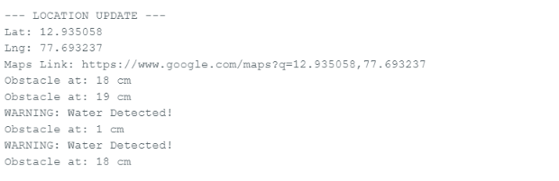

# Smart Blind Stick

## Features
- Obstacle detection using ultrasonic sensor
- Water detection
- GPS location tracking

## Components
- Arduino Uno
- HC-SR04
- Water Sensor
- NEO-6M GPS

## Project Images
output 

## Demo Video
[Watch Demo](smart blind stick.mp4)
